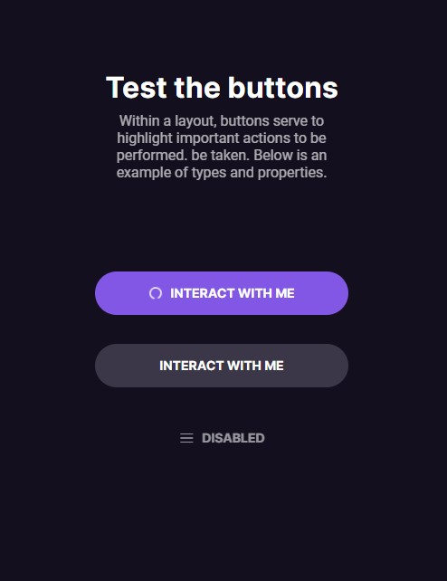

<h1 align="center"> Buttons and Cursors </h1>

Project developed to show button types and properties, very important in a layout to highlight actions. 

  <a href="#-technologies">Technologies</a>&nbsp;&nbsp;&nbsp;|&nbsp;&nbsp;&nbsp;
  <a href="#-project">Project</a>&nbsp;&nbsp;&nbsp;|&nbsp;&nbsp;&nbsp;
  <a href="#-layout">Layout</a>&nbsp;&nbsp;&nbsp;|&nbsp;&nbsp;&nbsp;
  <a href="#memo-license">License</a>

  

 

  

## 🚀 Technologies

This project was developed with the following technologies:

- HTML e CSS
- JavaScript
- Git and Github
- Figma

## 💻 Project

Project developed to show some button actions.

- [Visit the project online](https://fxharry.github.io/buttonsandcursors/)

## 🔖 Layout

You can preview the project through [This Link](https://www.figma.com/community/file/1195327109778210238). It is necessary to have an account on [Figma](https://figma.com) to access it.

## :memo: License

This project is licensed under the MIT license.

---

Developed in the [#BoraCodar](https://boracodar.dev/) together with the teacher [@maykbrito](maykbrito.dev) and [@rocketseat](https://rocketseat.com.br) 👨‍💻💞
